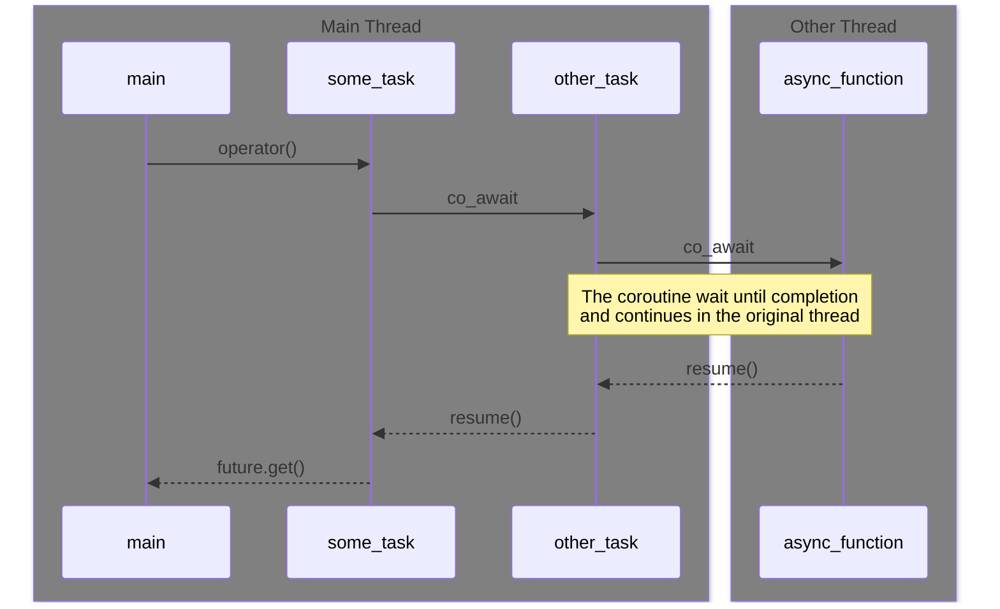

 

# lzc-coro - LaZyCoders COROutine library

This small library have the objective of understand coroutine facility. It is
too a playground to test some ideas about how coroutines could work.

# The basics

This library only implements the `task`: a coroutine that can do `co_await`.

All `tasks` can be awaitable and are created stopped. That means a coroutine do
not start executing code until the call to `operator()` of the `task` is called.

